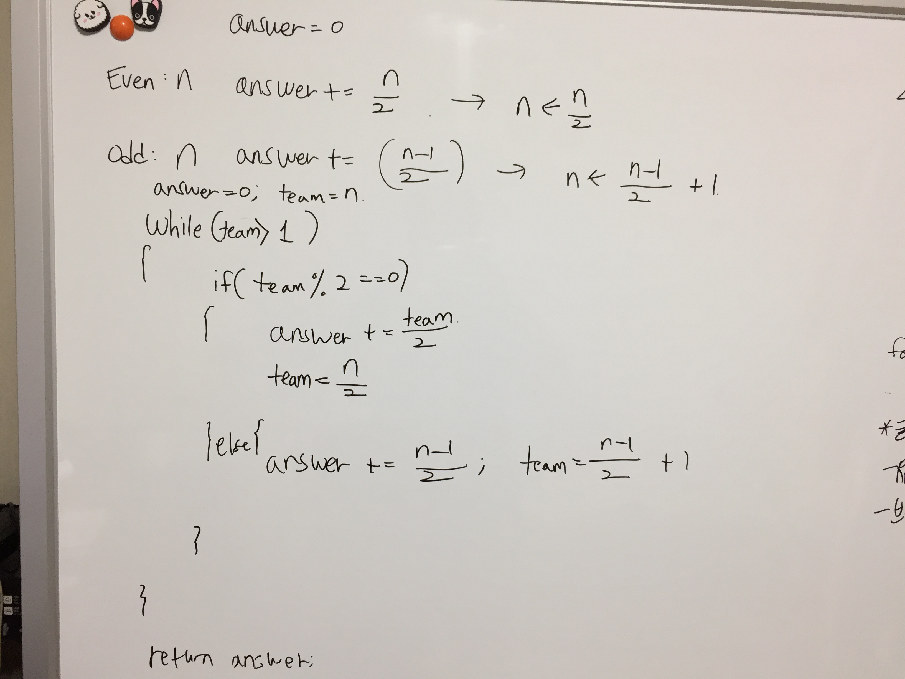

# Link to Question
https://leetcode.com/contest/weekly-contest-219/problems/count-of-matches-in-tournament/

## Question Summary
아휴 제기랄 이거 일주일만 먼저 풀었어도 nhn 면접 통관데 시부럴 일이 안풀릴려면 이렇게 안풀리네 제기랄

## My solution summary



## My code
```
/**
 * @param {number} n
 * @return {number}
 */
var numberOfMatches = function(n) {
    let answer = 0;
    let team = n;
    
    while(team > 1){
        if(team % 2 == 0){
            answer += (team / 2);
            team /= 2;
        }else{
            answer += (team - 1)/2;
            team = (team-1)/2 + 1;
        }
    }
    
    return answer;
};
```
