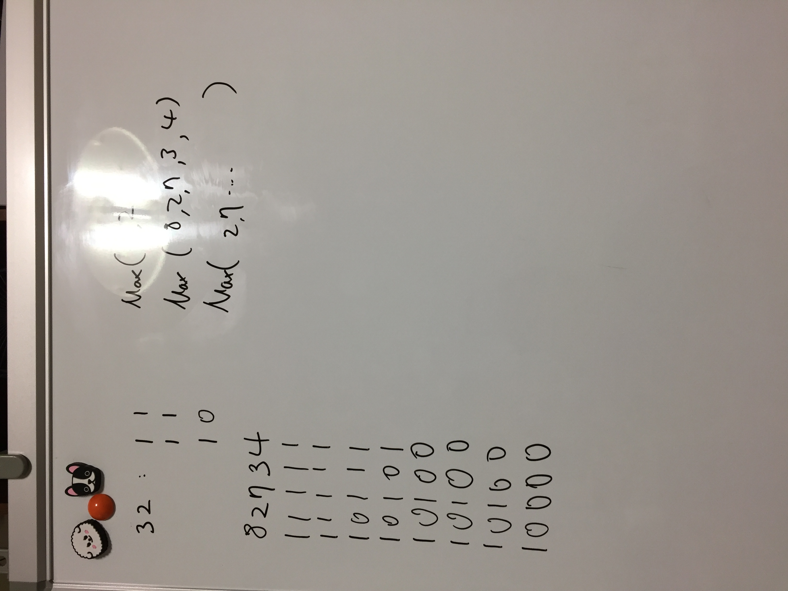

# Link to Question
https://leetcode.com/contest/weekly-contest-219/problems/partitioning-into-minimum-number-of-deci-binary-numbers/

## Question Summary
1 이나 0으로만 되야한다. 그냥 어떤 위치의 수가 9면 숫자가 최소 9개 필요하니까, 답이 9.
그래서 각 숫자 중 최댓값이 답이다. 

## My solution summary


## My code
```
/**
 * @param {string} n
 * @return {number}
 */
var minPartitions = function(n) {
    let m = '0';
    for(let i = 0; i < n.length; i++){
        if(n[i] - m > 0){
            m = n[i];
        }
    }
    return m;
};
```
