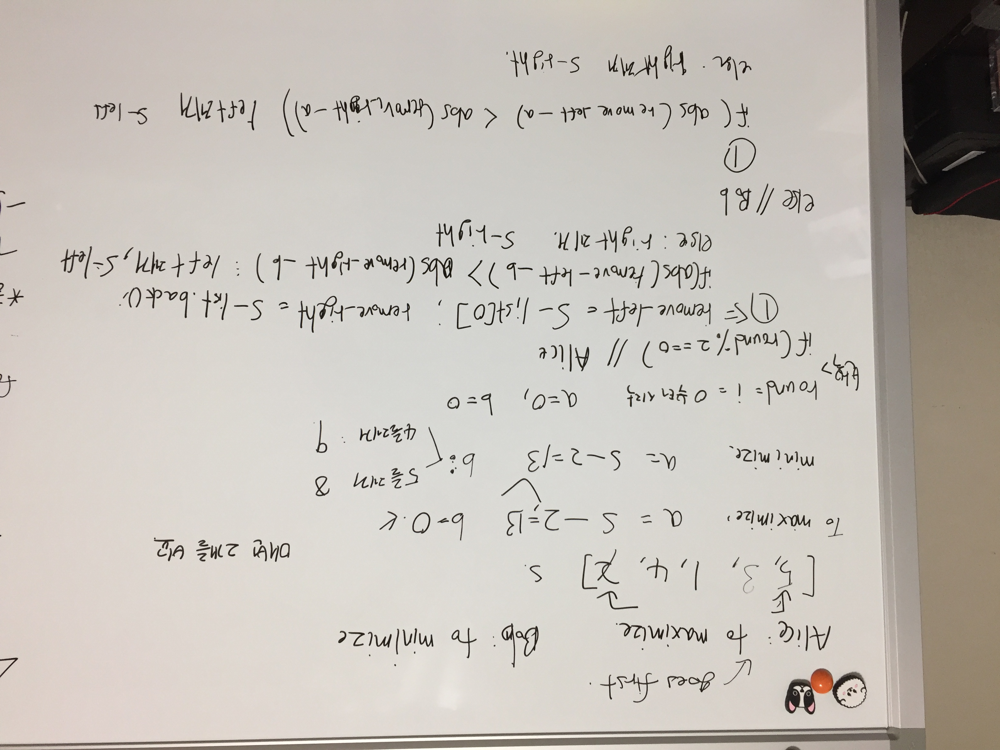

# Link to Question
https://leetcode.com/contest/weekly-contest-219/problems/stone-game-vii/

## Question Summary
- 'Bob' wants to minimize the score's difference: He wants to maximize his score

- 'Alice' wants to maximize the difference: She wants to maximize her score. 

Because Bob knows he will always lose this game, we know that Alice's score will always be larger than Bob's, which means to minimize the score's difference(Alice's score - Bob's score), Bob has to maximize his score. On the other hand, Alice have to maximize her total score. 

- [이글](https://leetcode.com/problems/stone-game-vii/discuss/970268/C%2B%2BPython-O(n-*-n)) 에 달린 답변

```
A brilliant solution! My humble understanding: suppose n=5, then Alice's gain is a1+a3+a5 where a1 means the 1st round's gain for Alice. Bob's gain is b2+b4. The final difference is (a1+a3+a5)-(b2+b4) which can be rewritten as a1-(b2-(a3-(b4-a5))). If we realize that a1>b2>a3>b4>a5, we know this is actually a recursive pattern. The optimal strategy for both players is to maximize my_current_round_gain - subproblem_difference. Alice wants to maximize a1-subproblem, so Alice wants to maximize a3-subproblem due to the double negation. The same for Bob. Bob wants to minimize a1-subproblem, so Bob wants to maximize b2-subproblem, then maximize b4-subproblem due to double negation. This insight will help reduce the complexity a lot since we only need one DP instead of two.
```

a1, a3, a5 는 각각 라운드 1, 3, 5에서 Alice가 얻은 점수이다. 

b2, b4는 Bob이 각 라운드에서 얻은 점수이다. 최종 점수차는 `(a1+a3+a5)-(b2+b4)`로 `a1-(b2-(a3-(b4-a5)))`로도 표현할 수 있다. 근데 각 라운드에서 얻을 수 있는 점수는 점점 줄어든다(왜냐하면 제거했으니까!!!) `a1>b2>a3>b4>a5` 긍까 이게 **재귀 호출 문제**임을 알 수 있다. 최선의 선택은 내 현재 점수를 최대화 하고, 그다음에서 다음에 나오는 점수 계산한게 최소화 되는 것이다. 

즉, `my_current_round_gain - subproblem_difference`

Alice는 a1-subproblem 를 최대화 하고 싶어하고, 이게 빼기때문에 식을 자세히 보면 a3-subproblem 도 최대화 해야 b2 - a3-subproblem 를 최소화할 수 있다.  

Bob도 a1-subproblem 을 최소화 하고 싶기 때문에, b2-subproblem 을 최대화 하고 싶다. 그리고 b4-subproblem 을 최대하 해서 a3-(b4-a5) 을 최소화 하고싶다. 

그렇기 때문에 각 라운드에서 a1 - subproblem 을 최대화 함으로써 문제를 해결 할 수 있다. 


## My solution summary
https://leetcode.com/problems/stone-game-vii/discuss/970363/Python-Top-Down-and-Bottom-Up-DP-explained

워....어렵다.... 미국놈들....


## My code
1. discussion 보고 만든 코드. 진짜 너무 어려웠다. 
```
/**
 * @param {number[]} stones
 * @return {number}
 */
var stoneGameVII = function(stones) {
    let n = stones.length;
    const sum = Array(n+1).fill(0);
    
    for(let i = 0; i < n; i++){
        sum[i+1] = sum[i] + stones[i]; // sum[1] = stones[0], sum[2] = stones[0] + stones[1], ....
    }
         
    const dp = [...Array(n)].map(x=>Array(n).fill(0));
    
    // 각 subproblem의 값을 최대화 해야한다. 
    // len 이 범위, 2, 3, 4, 5 ... 이렇게 늘어가면 (0, N-0) (1, N-1) .... 이 범위의 i에 대해서 j = i + len - 1을 구한다. 
    // n = 5,  len = 2, i 는 0에서 3까지, 즉 dp[0][1], dp[1][2], dp[2][3], dp[3][4] 제일 작은 문제를 해결
    // len = 3, i 는 0에서 2 까지, 즉 dp[0][2], dp[1][3], dp[2][4] 그다음 범위를 해결, 1단계가 이미 해결되어있음
    // ....
    
    for(let len = 2; len <= n; len++){
        for(let i = 0; i <= n - len; i++){
            let j = i + len - 1;
            dp[i][j] = Math.max(sum[j+1] - sum[i+1] - dp[i+1][j], sum[j] - sum[i] - dp[i][j-1]); 
        }
    }
    
    return dp[0][n-1];
};
```

2. 망한 코드: 각 계산을 할때 최선을 구하도록 했다. 그럼 틀림. 전체적으로 최선일때를 구해야함. 

```
/**
 * @param {number[]} stones
 * @return {number}
 */
var stoneGameVII = function(stones) {
    let a = 0;
    let b = 0;
    let s = 0;
    let r = 0;
    
    stones.forEach((e) => {
        s += e;
    })
    
    console.log(s);
    
    while(stones.length > 0){
        const remove_left = s - stones[0];
        const remove_right = s - stones[stones.length - 1];
        console.log(stones)
        if(r % 2 === 0){
            if(Math.abs(a + remove_left - b) > Math.abs(a + remove_right - b)){
                stones.shift();
                s = remove_left;
                a += remove_left;
            }else{
                stones.pop();
                s = remove_right;
                a += remove_right;
            }
        }else{
            if(Math.abs(b + remove_left - a) < Math.abs(b + remove_right - a)){
                stones.shift();
                s = remove_left;
                b += remove_left;
            }else{
                stones.pop();
                s = remove_right;
                b += remove_right;
            }
        }
        
        console.log(stones);
        r += 1;
    }
    
    return Math.abs(a - b);
};
```
