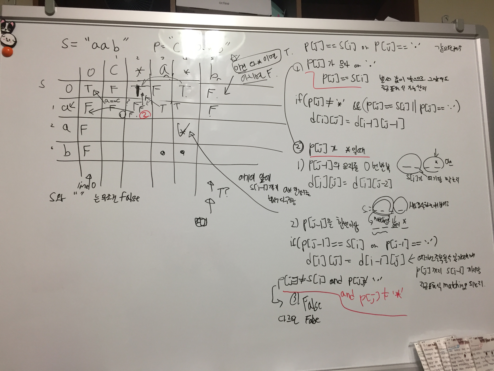

# Link to Question
https://leetcode.com/problems/regular-expression-matching/

## Question Summary

## My solution summary

효율은 엉망이지만 애썼다..ㅠ


일단 아무리 궁리해봐도 감을 못잡다가, 백트랙킹을 통해서 풀고자했다. 

기본적으론 재귀함수를 사용했다. 

```
function recursive(sIndex, pIndex, st, pList){}
```

위의 함수를 정의하고 재귀적으로 풀었고, 영 답이 아닐거같은거만 솎아 냈다. 

기본적으로 
1. 글자가 '.' 이거나 같으면서 '*' 문자와 함께 오는 경우
    - 글자가 같으면 사용하고, 그다음에도 똑같은 글자 사용하기: `recursive(sIndex+1, pIndex, st + curS, pList);`
    - 글자가 같으면 사용하고, 그다음엔 다음 글자 사용하기: `recursive(sIndex+1, pIndex+1, st + curS, pList);`
    - 글자가 같아도 사용안하고, 다음글자 사용하기: `recursive(sIndex, pIndex+1, st, pList);`
    - 글자가 그냥 달라서 다음 글자 사용하기: `recursive(sIndex, pIndex+1, st, pList);`
2. 글자가 '.' 이거나 같으면서 한번은 꼭 써야하는 경우
   - 글자가 달라서 그냥 다음 글자 사용하기: `recursive(sIndex+1, pIndex+1, st + curS, pList);`

이렇게 해결할 수 있다. 


```javascript
if(curMore === '*'){
    //반복 있음
    // 글자가 . 일때
    if(curP === '.' || curP === curS){
        // 글자가 같으면 사용하고, 그다음에도 똑같은 글자 사용하기
        // console.log("step1")
        recursive(sIndex+1, pIndex, st + curS, pList);
        if(found === true){
            return;
        }
        
        // console.log("step2")
        // 글자가 같으면 사용하고, 그다음엔 다음 글자 사용하기
        recursive(sIndex+1, pIndex+1, st + curS, pList);
        if(found === true){
            return;
        }  
        
        // console.log("step3")
        // 글자가 같아도 사용안하고, 다음글자 사용하기
        recursive(sIndex, pIndex+1, st, pList);
        if(found === true){
            return;
        }  
    }else{
            // 글자가 달라서 그냥 다음 글자 사용하기
        // console.log("step3")
        recursive(sIndex, pIndex+1, st, pList);
        if(found === true){
            return;
        }
    }
}else{
    // 반복 없음
    if(curP === '.' || curP === curS){
        // 글자가 같으면 사용하고, 그다음엔 다음 글자 사용하기
        // console.log("step4")
        recursive(sIndex+1, pIndex+1, st + curS, pList);
        if(found === true){
            return;
        }
    }
    // else{
    //      // 글자가 달라서 그냥 다음 글자 사용하기
    //     // console.log("step5")
    //     recursive(sIndex, pIndex+1, st, pList);
    //     if(found === true){
    //         return;
    //     }
    // }
}
```

재귀함수가 종료되는 조건은, 남은 p가 없을때나, 문자를 다 만들었을때이다. 
문자를 다 만들었을때 남은 p 중에 꼭써야하는애가 있으면 그냥 종료하고, 꼭써야하는 애가 없으면 정답인 경우를 찾은거라 전역으로 선언한, found는 true로 설정하고, 이후의 재귀호출은 다 return 시켜버렸다. 

```javascript
if(st.length >= s.length){
    // console.log("final", st);
    for(let i = pIndex; i < pList.length; i++){
        if(pList[i][1] === '0'){
            // console.log("!!!!")
            return;
        }
    }  
    found = true;
    return;
}

if(pIndex >= pList.length){
    // 글자길이는 안맞는데, p는 이미 다 끝났을때 
    return;
}
```


예쁘고 효율적으론 못짠거같지만, 그래도 풀어서 좀 뿌듯하다. 

예전엔 고민을 해도 못푸는 문제가 많았는데, 이제는 머리싸매고 고민하면 풀어지는 문제가 많아서 기분이 좋다. 

- [dp 풀이](https://leetcode.com/problems/regular-expression-matching/discuss/5665/My-concise-recursive-and-DP-solutions-with-full-explanation-in-C%2B%2B)
아무리풀이를 봐도 이해가 안되서... [영상](https://www.youtube.com/watch?v=l3hda49XcDE&list=PLrmLmBdmIlpuE5GEMDXWf0PWbBD9Ga1lO&ab_channel=TusharRoy-CodingMadeSimple) 을 봤다. 젤잘가르침진짜;; 

T[i][j] 는 s라는 문자열과, p라는 정규표현식이 잇을때 s[i] 까지랑 정규표현식 p[j]까지가 matching이 된단 소리다. 

이렇게 되는 경우는 총 세가지가 있는데, 

1. (p[j] 가 *가 아닐때!) s[i] 랑 p[j] 가 matching이 되는 것이다. ('a'=='a' 나 'a'=='.') T[i-1][j-1] 까지 matching이면 matching이다
2. (p[j]가 *일때는 이제 일이 조금 복잡해지는데...) 
   1. 그냥 p[j-1]에 있는 문자를 그냥 싹 무시하고 안쓸수도 있다. 이렇게 matching하는가는 T[i][j-2] (s[i] 까지, pattern p[j-2] 까지 문자랑 matching 되는지!!)
   2. 근데 p[j-1]에 있는 문자랑 같다고 체크할 수도 있다. 이때 s[i]랑 p[j-1]이 같으면(p[j-1] == '.' 도 가능) s[i-1] 까지의 문자랑, p[j] 또는 p[j-2] 까지가 matching이면 true가 된다. 
3. 아니면 안되거나, false

- dp 풀이
```javascript
/**
 * @param {string} s
 * @param {string} p
 * @return {boolean}
 */
var isMatch = function(s, p) {
    const m = s.length;
    const n = p.length;
    const dp = [...Array(m+1)].map(x => Array(n+1).fill(false));
    
    dp[0][0] = true;// 아무것도 없으면 true
    // s[i] 는 dp[i+1], 인덱스는 하나씩 더해서 비교한다. s[0]번째 문자는 dp의 1행이다
    
    for(let i = 1; i < n+1; i++){
        if(p[i-1] === '*'){
            dp[0][i] = dp[0][i-2]; //i-2들도 다 *여야만 true이다. * 없는거 하나라도 있으면 거기부턴 다 false임
        }
    }
    
    for(let i = 1; i < m+1; i++){
        for(let j = 1; j < n+1; j++){
            if(p[j-1] === s[i-1] || p[j-1] === '.'){
                dp[i][j] = dp[i-1][j-1];
            }else if(p[j-1] === '*'){
                // 0번 반복
                dp[i][j] = dp[i][j-2];
                
                if(p[j-2] === s[i-1] || p[j-2] == '.'){
                    dp[i][j] = dp[i][j] | dp[i-1][j]; // 두 경우중 하나라도 true면 true다
                }
            }else{
                dp[i][j] = false;
            }
        }
    }
    
    
    console.log(dp)
    return dp[m][n];
    
    
};
```

아 진짜 어려웠다. 풀이를 봐도 잘 이해가 안됬다. 여튼 어떻게든 이제는 진짜 이해를 하고 따라라도 풀어봤다. 


아직 dp 문제는 어려운 점이 있긴하다. 그래도 점점더 감이 오는거같긴하다. 


## My code
1. 효율은 개나줬지만, 어떻게든 기어코 내힘으로 푼 놀라운 코드
```javascript
/**
 * @param {string} s
 * @param {string} p
 * @return {boolean}
 */
var isMatch = function(s, p) {
    function splitP(p) {
        let i = 0;
        let result = [];
        
        while(i < p.length){
            if(p[i+1]==='*'){
                result.push([p[i], '*']); // 계속 쓸수 있다
                i += 2;
            }else{
                result.push([p[i], '0']); // 1번만 쓸수 있다. 
                i += 1;
            }
        }       
        return result;
    }
    
    const pList = splitP(p);
    // console.log(pList)
    let found = false;
    
    function recursive(sIndex, pIndex, st, pList){   
        // console.log(sIndex, pIndex, st, pList);
        
        if(st.length >= s.length){
            // console.log("final", st);
            for(let i = pIndex; i < pList.length; i++){
                if(pList[i][1] === '0'){
                    // console.log("!!!!")
                    return;
                }
            }  
            found = true;
            return;
        }
        
        if(pIndex >= pList.length){
            // 글자길이는 안맞는데, p는 이미 다 끝났을때 
            return;
        }
        
        const pp = pList[pIndex]; // 현재 비교할 정규 표현식
        const curP = pp[0];
        const curMore = pp[1];
        const curS = s[sIndex]; // 현재 생성해야하는 글자
        
        if(curMore === '*'){
            //반복 있음
            // 글자가 . 일때
            if(curP === '.' || curP === curS){
                 // 글자가 같으면 사용하고, 그다음에도 똑같은 글자 사용하기
                // console.log("step1")
                recursive(sIndex+1, pIndex, st + curS, pList);
                if(found === true){
                    return;
                }
                
                // console.log("step2")
                // 글자가 같으면 사용하고, 그다음엔 다음 글자 사용하기
                recursive(sIndex+1, pIndex+1, st + curS, pList);
                if(found === true){
                    return;
                }  
                
                // console.log("step3")
                // 글자가 같아도 사용안하고, 다음글자 사용하기
                recursive(sIndex, pIndex+1, st, pList);
                if(found === true){
                    return;
                }  
            }else{
                 // 글자가 달라서 그냥 다음 글자 사용하기
                // console.log("step3")
                recursive(sIndex, pIndex+1, st, pList);
                if(found === true){
                    return;
                }
            }
        }else{
            // 반복 없음
            if(curP === '.' || curP === curS){
                // 글자가 같으면 사용하고, 그다음엔 다음 글자 사용하기
                // console.log("step4")
                recursive(sIndex+1, pIndex+1, st + curS, pList);
                if(found === true){
                    return;
                }
            }
            // else{
            //      // 글자가 달라서 그냥 다음 글자 사용하기
            //     // console.log("step5")
            //     recursive(sIndex, pIndex+1, st, pList);
            //     if(found === true){
            //         return;
            //     }
            // }
        }
        
    }
    
    recursive(0, 0, '', pList);
    
    return found;
};

// "aab"
// "c*a*b"
// "mississippi"
// "mis*is*p*."
// "aa"
// "a"
// "ab"
// ".*"
```
2. 일단 망한 코드
```javascript
/**
 * @param {string} s
 * @param {string} p
 * @return {boolean}
 */
var isMatch = function(s, p) {
    function splitP(p) {
        let i = 0;
        let result = [];
        
        while(i < p.length){
            if(p[i+1]==='*'){
                result.push([p[i], '*']); // 계속 쓸수 있다
                i += 2;
            }else{
                result.push([p[i], '0']); // 1번만 쓸수 있다. 
                i += 1;
            }
        }       
        return result;
    }
    
    const pList = splitP(p);
    
    console.log(pList)
    
    let sIndex = 0;
    let pIndex = 0;
    
    while(pIndex < pList.length && sIndex < s.length){
        const cur = pList[pIndex];
        if(cur[1] === '0'){
            // 반복이 아닐때
            if(cur[0] === '.'){
                sIndex++;
            } else {
                if(s[sIndex] !== cur[0]){
                    return false
                }else{
                    sIndex++;
                }
            }
            
            pIndex++;
        }else{
            // 반복 일때
            if(cur[0] === '.'){
                sIndex++
            } else {
                if(s[sIndex] !== cur[0]){
                    pIndex++;
                }else{
                    sIndex++;
                }
            }
        }
    }
    
    for(let i = pIndex; i < pList.length; i++){
        if(pList[i][1] === '0'){
            return false;
        }
    }
    
    if(sIndex === s.length){
        return true;
    }else{
        return false;
    }
    
};
```
