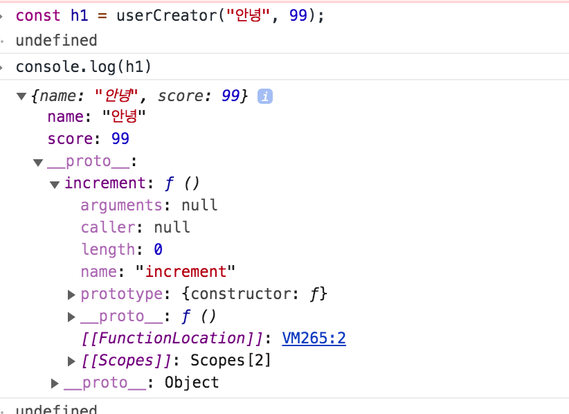
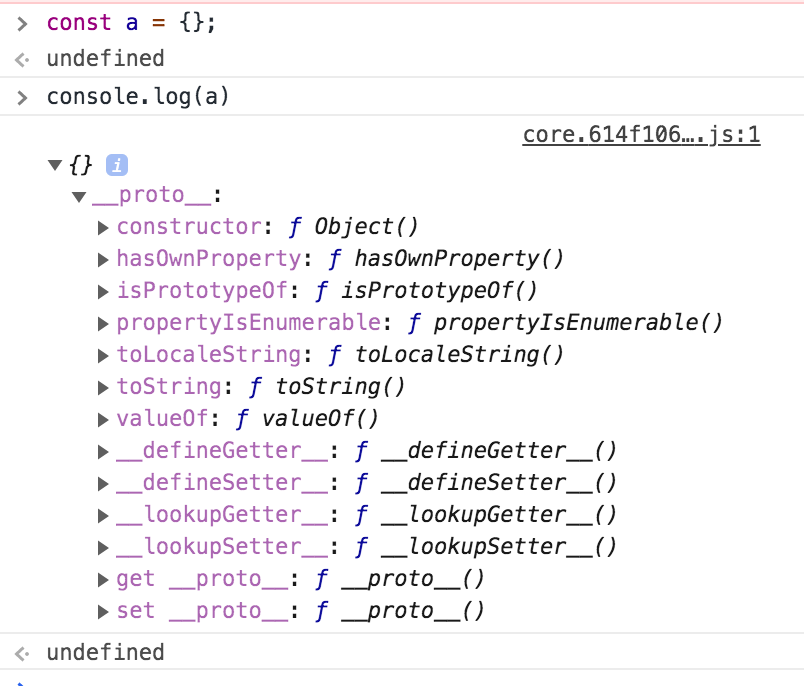
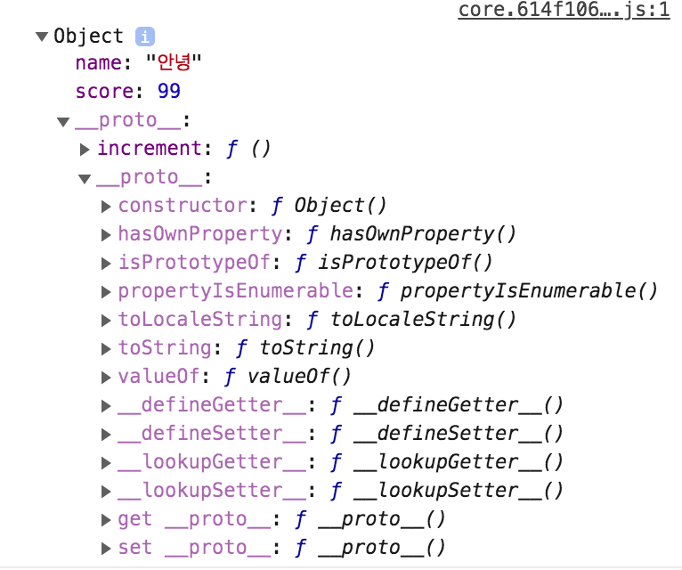

# Link to Question
https://leetcode.com/contest/weekly-contest-209/problems/even-odd-tree/

## Question Summary
진짜 문제 읽기 싫기 생겼고, 조건도 막 혼란하다. 
```
For every even-indexed level, all nodes at the level have odd integer values in strictly increasing order (from left to right).
For every odd-indexed level, all nodes at the level have even integer values in strictly decreasing order (from left to right).
```
level은 0, 1, 2, 3, 이런순으로 있을 건데, \
level = 0, 2, 4 ... 이런애들은 무조건 같은 층내에 있는 숫자들이 <strong>_홀수_</strong> 이고 무조건 증가하는 순서로 있어야한다. \
level = 1, 3, 4 ... 이런애들은 무조건 같은 층내에 있는 숫자들이 <strong>_짝수_</strong> 이고 무조건 감소하는 순서로 있어야한다. \
트리 구조를 줄건데(바이너리) 위의 조건을 다 만족하면 Even-odd한 트리로 true 를 반환하고, 아니면 false를 반환해라. \
(아니 홀짝은 한국어로도 헷갈리는데, 얘네는 even odd 이렇게 해가지고 진짜 애기때부터 계속 헷갈린다;;;) 


## My solution summary
1. 자바스크립트 객체 생성 다시한번 강의보고 정리
https://jongmin92.github.io/2017/06/18/JavaScript/class/
처음에 문제를 잘못이해해서 root = [1,10,4,3,null,7,9,12,8,6,null,null,2] 가 리스트로 주어지는 줄 알고, 이를 처리할 관련 객체를 하나 생성하려고 했다. \
그러다가 다시 자바스크립트 객체 생성 원리에 대해서 복습했다. 

* 자바스크립트에서 객체 생성할때 방법 1 ->  현실적이진 않고, 매번 생성이 어려움
```
const user = Object.create(null);
user.score = 1;
user.increment = function(){
    user.score++
}
```

* 자바스크립트에서 객체 생성할때 방법 2 ->  얘는 매번 함수까지 복사 해야하는 문제가 있음
```
function userCreator(name, score){
    const newUser = {};
    newUser.name = name;
    newUser.score = score;
    newUser.increment = function(){
        newUser.score++
    }
    return newUser;
}
```
이렇게 객체를 생성하는 함수를 만들수도 있다. 

* 자바스크립트에서 객체 생성할때 프로토타입 체인을 활용 (Object.create()) ->  얘는 함수도 계속 복사하는게 아니라 함수는 한번만 정의되고 프로토타입 특성을 활용한다. (나한테 뭔가 없으면 나랑 연결된 뭔가로 가서 확인하는 것)

```
function userCreator(name, score){
    const newUser = Object.create(userFunctionStore);
    newUser.name = name;
    newUser.score = score;
    return newUser;
}

const userFunctionStore = {
       increment: function(){this.score++},
}
```
 \
그리고 이렇게 create를 통해서 연결해준애들은 __proto__ 안에 있다.

 \
빈깡통을 만들어도 안에 프로토타입은 있다. 

 \

* new 사용
```
function userCreator(name, score){
    this.name = name;
    this.score = score;
}

// userCreator.prototype {}

userCreator.prototype.increment = function(){
       this.score++;
}

const user1 = new UserCreator("hayoung", 3);
```

* class 사용 -> 모양만 그렇고 클래스 아니다. 
```
class UserCreator{
    constructor(name, score){
        this.name = name;
        this.score = score;
    }
    increment(){this.score++;}
}

const user = new UserCreator("hayoung", 11);

```
클래쓰를 쓸거다. 


2. 구조분해 할당
https://developer.mozilla.org/ko/docs/Web/JavaScript/Reference/Operators/Destructuring_assignment

```const [cur, level] = queue.shift(); ```
구조 분해 할당에 대해서 간단히 복습했다. 


3. 여튼 풀이..
```
queue.push([root, 0]); 
```

큐에 루트와 level=0을 넣고 시작해서, 
왼쪽 오른쪽 갈때마다 순서대로 큐에 넣어준다. 

그러면 큐다보니까, 

level 이 n 인 애들이 큐에 다 들어가고 나서, level n+1인애들이 그다음에 들어간다. 

그외에는 그냥 얘네 조건이 드러워서 그거나 잘 정리하면 되는 문제이다. 

```
let isLevelEven = false;
let prev = -1;
```

얘를 통해서 even한 레벨인지 아닌지를 체크하는데, 처음에는 아니라고 해두고, 시작을 했다.(0이 even하다고 even하다고 시작하지 않았다)

그 이유는 
```
if((level%2 === 0 && !isLevelEven) || (level%2 === 1 && isLevelEven)){
    // 홀수에서 -> 짝수 || // 짝수에서 -> 홀수     
    isLevelEven = !isLevelEven;     
    console.log(cur.val)
}
```
얘를 통해서 

레벨은 홀수인데, isLevelEven = true면 새로운 레벨로 증가했구나(레벨이 짝수인데, isLevelEven=false 인 경우에도 마찬가지) 인 성질을 이용해서 새로운 층으로 증가하고 나서\
각각에 맞는 규칙을 적용할 수 있도록 했다. (root일때도 새로운 층으로 증가했다고 하기 위해서 초기값을 false로 해서 홀수층에서 올라온것처럼했다. )


## My code
2. 정리한다고 정리한 코드
```

var isEvenOddTree = function(root) {
    let queue = []; 
    queue.push([root, 0]); // current value, level
    
    let isLevelEven = false;
    let prev = -1;
    
    while(queue.length !== 0){
        const [cur, level] = queue.shift();
          
        if((level%2 === 0 && !isLevelEven) || (level%2 === 1 && isLevelEven)){
            // 홀수에서 -> 짝수 || // 짝수에서 -> 홀수     
            isLevelEven = !isLevelEven;     
            console.log(cur.val)
        }else if(isLevelEven && prev >= cur.val){
            return false;
        }else if(!isLevelEven && prev <= cur.val){
            return false;
        }
        
        if(isLevelEven && cur.val % 2 === 0 || !isLevelEven && cur.val % 2 === 1){
            return false;
        }
           
        prev = cur.val;
                
        if(cur.left){
            queue.push([cur.left, level+1]);
        }
        if(cur.right){
            queue.push([cur.right, level+1]);
        }
    }
    
    return true;
};
```

1. 정리전
```
/**
 * Definition for a binary tree node.
 * function TreeNode(val, left, right) {
 *     this.val = (val===undefined ? 0 : val)
 *     this.left = (left===undefined ? null : left)
 *     this.right = (right===undefined ? null : right)
 * }
 */
/**
 * @param {TreeNode} root
 * @return {boolean}
 */
var isEvenOddTree = function(root) {
    let queue = []; 
    queue.push([root, 0]); // current value, level
    
    let isEven = false;
    let prev = -1;
    
    while(queue.length !== 0){
        const [cur, level] = queue.shift();
          
        if((level%2 === 0 && !isEven) || (level%2 === 1 && isEven)){
            // 홀수에서 -> 짝수 || // 짝수에서 -> 홀수     
            isEven = !isEven;     
        }else{
            console.log(prev, cur.val);
            
            if(!isEven){
                if(prev <= cur.val){
                    // console.log("odd", prev, cur.val);
                    return false;
                }
            }else{
                if(prev >= cur.val){
                    // console.log("even",prev, cur.val);
                    return false;
                }
            }
        }
        
        if(cur.val % 2 == 0 && isEven || cur.val % 2 === 1 && !isEven){
            return false;
        }
        
        prev = cur.val;
                
        if(cur.left){
            queue.push([cur.left, level+1]);
        }
        if(cur.right){
            queue.push([cur.right, level+1]);
        }
    }
    
    return true;
};
```
