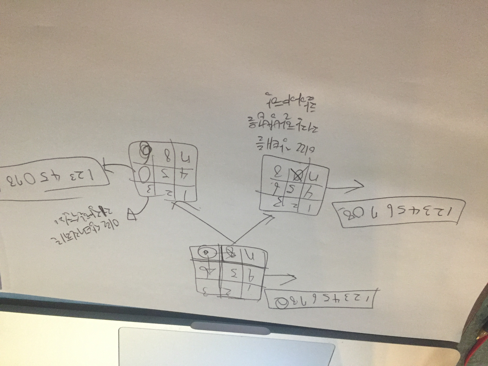

## 그래프 문제의 핵심
그래프는 문제가 아무리 복잡해도 핵심은 
어떤 상태에서 다른 상태로 변하는 것을 정확히 표현하는 것이 핵심이다. 
```
/******************************************************************************

                              Online C++ Compiler.
               Code, Compile, Run and Debug C++ program online.
Write your code in this editor and press "Run" button to compile and execute it.

*******************************************************************************/

#include <iostream>
#include <vector>
#include <algorithm>
#include <map>
#include <queue>
using namespace std;
int a, b, c; 
map<vector<int>, int> visited;
queue<vector<int>> q;

void pour(int fi, int ti, vector<int> cur){
    int from = cur[fi];
    int to = cur[ti];
    
    int toLimit = 0;
    if(ti == 0){
        toLimit = a;
    }else if(ti == 1){
        toLimit = b;
    }else if(ti == 2){
        toLimit = c;
    }
    // cout << "ti: " << ti << " " << toLimit << "\n";
    int available = toLimit - to;
    if(available > 0){
        if(from == available){
            vector<int> temp = cur;
            temp[fi] = 0;
            temp[ti] = toLimit;
            if(visited.count(temp) == 0){ 
                visited[temp] = 1;
                q.push(temp);
            }
        }else if(from > available){
            vector<int> temp = cur;
            temp[fi] = from - available;
            temp[ti] = toLimit;
            if(visited.count(temp) == 0){ 
                visited[temp] = 1;
                q.push(temp);
            }
        }else if(from < available){
            vector<int> temp = cur;
            temp[fi] = 0;
            temp[ti] = to + from;
            if(visited.count(temp) == 0){ 
                visited[temp] = 1;
                q.push(temp);
            }
        }
    }
}

int main()
{
    cin >> a >> b >> c;
    vector<int> answer;
    
    vector<int> start(3, 0); start[2] = c;
    visited[start] = 1;
    q.push(start);
    
    while(!q.empty()){
        vector<int> cur = q.front();
        q.pop();
        
        if(cur[0] == 0){
            answer.push_back(cur[2]);
        }
        
        // cout << cur[0] << " " << cur[1] << " " << cur[2] << "\n";
        
        int A = cur[0];
        int B = cur[1];
        int C = cur[2];
        // A를 옮길때
        if(A != 0){
            pour(0, 1, cur);
            pour(0, 2, cur);
        }
        
        // B를 옮길때
        if(B != 0){
            pour(1, 0, cur);
            pour(1, 2, cur);
        }
        
        // C를 옮길때
        if(C != 0){
            pour(2, 0, cur);
            pour(2, 1, cur);
        }
    }
    
    sort(answer.begin(), answer.end());
    for(int i = 0; i < answer.size() - 1; i++){
        cout << answer[i] << " ";
    }
    cout << answer.back() << "\n";
    
    return 0;
}

```

이문제는 https://www.acmicpc.net/problem/2251 물통의 물을 옮기는 문제인데, 다양한 풀이 가있겠지만
핵심은 ABC각각의 물통의 상태를 나타낼 방법을 고민하고, 각 상태변화에 대해서 제대로 기록할 수 있는 것이다. 

나는 ABC의 물통의 상태가 각각 0,0,10일때 부터 시작해서 A로 물을 부었을때, B로 부었을때 등의 상황을 정의하고, 
특히 한번 계산을 했던 상태는 다시 계산하지 않도록 이 경우에는 map을 통해서 어떤 상태를 검사했었는지 확인해서 중복이 없도록 모든 상태를 찾은 것이다. 그래프 이론이 정말 중요한 이유는 프로그램에서 사용자들의 많은 상태에 대해서 처리를 할 수있도록 하기 위함인 것 같다. 


## 벡터 사용법 정리
vector<vector<int>> map(N, vector<int> (N, 0));
vector<vector<int>> visited(N, vector<int> (N, false));

## 큐 사용법 정리
queue<pair<int, int>> q;
q.push({i, j})
int x = q.front().first;
int y = q.front().second;
q.pop();


## string
```
#include <string>

string s = to_string(인티저);

```


## algorithm 정리
sort(answer.begin(), answer.end());

## bfs 문제
```
### 내 풀이
#include <iostream>
#include <vector>
#include <queue>
#include <algorithm>
using namespace std;

int N;
    
int bfs(int i, int j, vector<vector<int>> &map, vector<vector<int>> &visited){
    int s = 1;
    int dx[4] = {1, 0, -1, 0};
    int dy[4] = {0, 1, 0, -1};
    
    visited[i][j] = true;
    queue<pair<int, int>> q;
    q.push({i, j});
    
    while(!q.empty()){
        int x = q.front().first;
        int y = q.front().second;
        q.pop();
        
        for(int i = 0; i < 4; i++){
            int nx = x + dx[i];
            int ny = y + dy[i];
            
            if(nx < 0 || ny < 0 || nx >= N || ny >= N){
                continue;
            }
            
            if(map[nx][ny] == 0 || visited[nx][ny] == true){
                continue;
            }
            
            s++;
            visited[nx][ny] = true;
            q.push({nx, ny});
        }
    }
    
    return s;
}


int main(){
    cin >> N;
    
    vector<vector<int>> map(N, vector<int> (N, 0));
    vector<vector<int>> visited(N, vector<int> (N, false));
    
    for(int i = 0; i < N; i++){
        for(int j = 0; j < N; j++){
           int temp;
           cin >> temp;
           map[i][j] = temp;
        }
    }
    
    vector<int> answer;
    
    for(int i = 0; i < N; i++){
        for(int j = 0; j < N; j++){
            if(map[i][j] == 1 && visited[i][j] == false){
                int s = bfs(i, j, map, visited);  
                answer.push_back(s);
            }
        }
    }
    
    
    if(answer.size() == 0){
        cout << 0 << "\n";
    }else {
        sort(answer.begin(), answer.end());
        cout << answer.size() << "\n";
        
        for(int i = 0; i < answer.size()-1; i++){
            cout << answer[i] << " ";
        }
        
        cout << answer.back() << " ";
    }

    return 0;
}
```


## 그래프 문제
1. 1차원(그냥 선이 연결되어있는 경우)
https://www.acmicpc.net/problem/11724

```
#include <iostream>
#include <vector>
using namespace std;

int n, m;
bool check[1001];
vector<int> arr[1001];

void dfs(int start){
    check[start] = true;
    
    for(int i = 0; i < arr[start].size(); i++){
        if(check[arr[start][i]] == false){
            dfs(arr[start][i]);
        }
    }
}

int main(){
    cin >> n >> m;
    for(int i = 0; i < m; i++){
        int u, v;
        cin >> u >> v;
        arr[u].push_back(v);
        arr[v].push_back(u);
    }
    
    int c = 0;
    for(int i = 0; i < n; i++){
        if(check[i+1] == false){
            c++;
            dfs(i+1);
        }
    }
    
    cout << c << "\n";
}
```


2.1차원일때
(이분그래프)https://www.acmicpc.net/source/18354076

(DSLR) https://www.acmicpc.net/problem/9019


3. 2차원 정보만 쓸때


4. 2차원 정보에 뭔가 추가적인 행위(벽을 부순다던지, 벽을 한번만 부순다던지 뭐그런 복잡한 문제들)
- https://www.acmicpc.net/problem/1261


- 가중치가 다를때(한칸씩 증가하는게 아니거나 그럴때()deque
https://blockdmask.tistory.com/73

deque를 사용해서 큐의 앞에도 값을 넣을수잇게 한다. 
dq - push_front, pop_front \
dq - push_back, pop_back

- 뭔가 2차원인데, 그냥 지동에서 좌표 이동하는게 아니라,좌표 이동할때마다 상태가 변하게 되는문제들(어렵다-좌표 이동을 하는게, 다른상태로 변하는것)
https://www.acmicpc.net/problem/1525

특히



이런것 처럼 각 상태변화가, 벽을 몇개 깻는지처럼 숫자하나로 나타낼수있는게 아니라 이차원 벡터로 나타나진다면,이를 어떻게 표현할 것인가를 고민해봐야한다. 

즉 기존의 많은 문제들은 bfs를 활용했을때, 1이라는 상태에서 2, 3 , 4로 변하거나, 
(0,0) - >(0,1) 이렇게 상태가 변하면서, 추가적으로 기록해야하는 상태를 포함하면 되는데

2차원상태가 변하면(예를들어 슬라이딩 퍼즐), 이를 어떻게 큐든 스택이든 넣어서 이전 상태, 다음상태, 다음상태로 넘어갈수 있도록 고민을 해보자(근데, 이차원표를 그냥 때려넣을수 있으면 좋겠지만, 그러면 뭔가 안되긴 할거다. 

이 문제에서는
```
map<vector<int>, int> 
map<string, int> 
map<int, int>
```
    
    
등을 활용하자
    
   1234567890 -> 123450786 이렇게!

map 
https://twpower.github.io/91-how-to-use-map-in-cpp


```
/******************************************************************************

                              Online C++ Compiler.
               Code, Compile, Run and Debug C++ program online.
Write your code in this editor and press "Run" button to compile and execute it.

*******************************************************************************/

#include <iostream>
#include <vector>
#include <map>
#include <queue>
using namespace std;

int arr[3][3];
int sx, sy;
string ss = "";
string es = "123456780";

int dx[4] = {1, 0, -1, 0};
int dy[4] = {0, 1, 0, -1};

int main()
{
    for(int i = 0; i < 3; i++){
        for(int j = 0; j < 3; j++){
            int temp; cin >> temp;
            arr[i][j] = temp;
            ss += to_string(temp);
            if(temp == 0){
                sx = i; 
                sy = j;
            }
        }
    }
    
    map<string, int> visited;
    queue<pair<string, pair<int, int>>> q;
    
    visited[ss] = 0;
    q.push({ss, {sx, sy}});
    
    while(!q.empty()){
        string next = q.front().first;
        int d = visited[next];
        
        if(next == es){
            break;
        }
        
        char narr[3][3] = {
            {next[0], next[1], next[2]},
            {next[3], next[4], next[5]},
            {next[6], next[7], next[8]},
        };
        
        int zx = q.front().second.first;
        int zy = q.front().second.second;
        q.pop();
        
        for(int i = 0; i < 4; i++){
            int nx = zx + dx[i];
            int ny = zy + dy[i];
            if(nx < 0 || nx >= 3 || ny < 0 || ny >= 3){
                continue;
            }
            
            narr[zx][zy] = narr[nx][ny];
            narr[nx][ny] = '0';
            
            string st = "";
            st += narr[0][0];
            st += narr[0][1]; 
            st += narr[0][2]; 
            st += narr[1][0];
            st += narr[1][1]; 
            st += narr[1][2]; 
            st += narr[2][0];
            st += narr[2][1]; 
            st += narr[2][2]; 
            
            if(visited.count(st) == 0){
                visited[st] = d + 1;
                q.push({st, {nx, ny}});
            }
            
            narr[nx][ny] = narr[zx][zy];
            narr[zx][zy] = '0';
        }
        
    }
    
    if(visited.count(es) == 0){
        cout << "-1" << "\n";
    }else{
        cout << visited[es] << "\n";
    }
    
    return 0;
}

```

#### 중요 string now = "aefegwe";
now.find('a') -> 이렇게 인덱스 찾을 수 잇다. 


### 모든 정점에서 모든 정점
플로이드 와샬https://mungto.tistory.com/58
