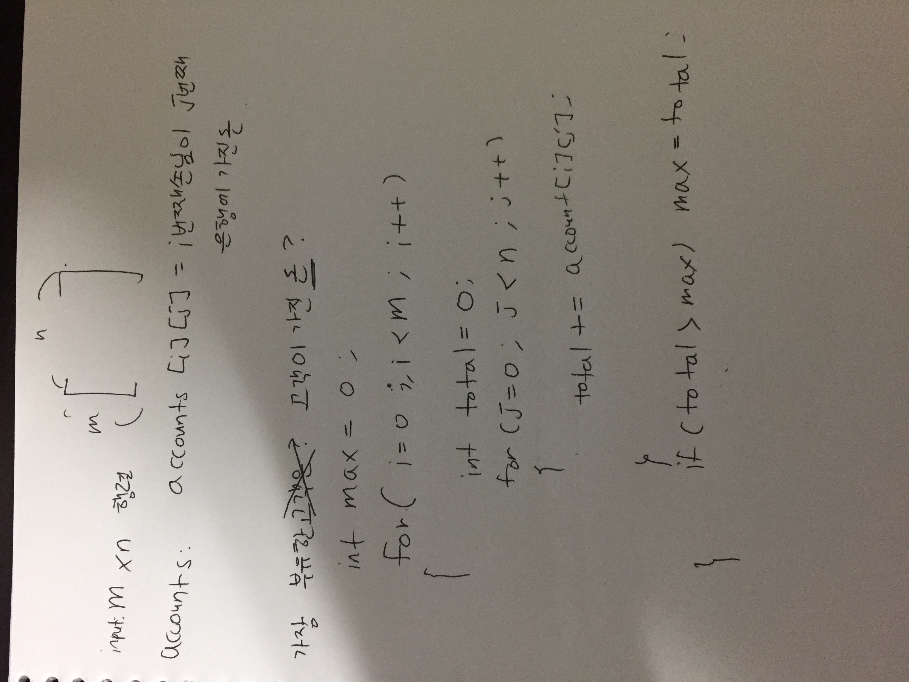

# Link to Question
https://leetcode.com/contest/weekly-contest-217/problems/richest-customer-wealth/

## Question Summary

## My solution summary


## My code
```
/**
 * @param {number[][]} accounts
 * @return {number}
 */
var maximumWealth = function(accounts) {
    let richest = 0;
    const m = accounts.length;
    const n = accounts[0].length;
    
    for(let i = 0; i < m; i++){
        let total = 0; 
        for(let j = 0; j < n; j++){
            total += accounts[i][j];
        }
        
        if(total > richest){
            richest = total;
        }
    }
    
    return richest;
};
```
