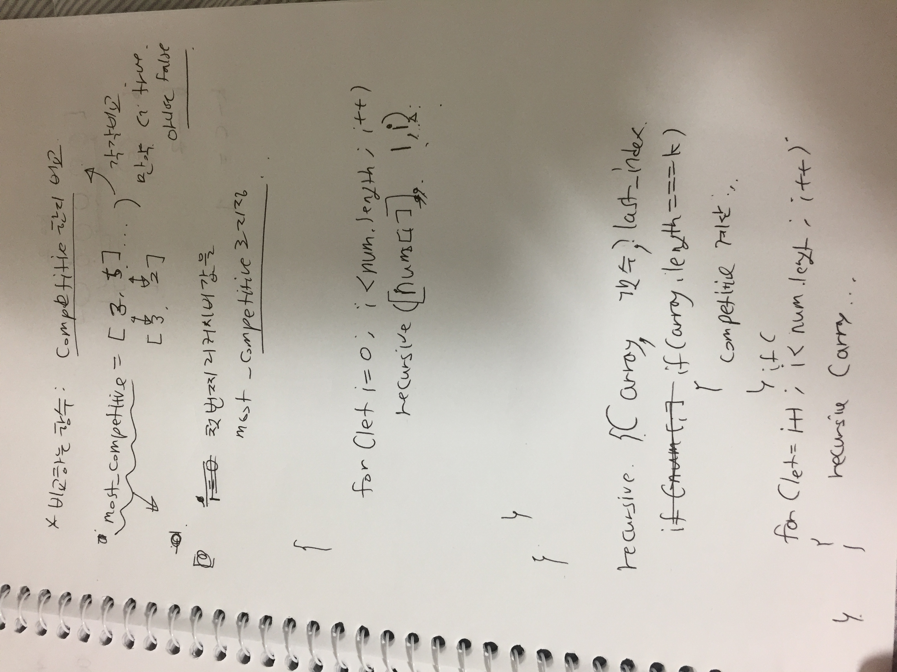

# Link to Question
https://leetcode.com/contest/weekly-contest-217/problems/find-the-most-competitive-subsequence/

## Question Summary

## My solution summary



시간 초과가 납니당. 
이건 망해서 풀이를 참고

[Use a mono incrasing stack.](https://leetcode.com/problems/find-the-most-competitive-subsequence/discuss/952786/JavaC%2B%2BPython-One-Pass-Stack-Solution)

앗.... Mono increasing stack 뭐 이런 개념이 있나보다. 내가 접근한 방식은 recursive하게 숫자를 다 구한건데, 솔직히 복잡도 상으로 무조건 망할 풀이이긴했다. 하지만 한번 해봣을뿐, 역시나 망했다. 

여튼간에, 핵심은

1. 현재 element a가 스택의 마지막 원소보다 작으면 대체하고 집어 넣는다. 
2. 근데 이때에, 이제 a 다음에 남은게 충분한지를 확인해야한다. 왜냐하면 무작정 다 빼고 넣어버리면, 뒤에 남은게 없어갖구, 큰일남. 
3. 스택의 마지막 원소를 빼고는 스택 크기는 stack.size() - 1이다. 그리고 a가 i번째 원소면? A.size() - i 개가 남아있다. (a포함)
4. 그래서 stack.size() - 1 + A.size() - i >= k 이면 한개 빼도 된다.  (즉, 하나빼고 남은거 다 넣었을때도 k이상일때만 뺄수있는거)
5. while(!stack.empty() && stack.back() > A[i] && stack.size() - 1 + A.size() - i >= k) 일동안 다 뺀다. 
6. 자리가 남았으면 넣는다. 


```
/**
 * @param {number[]} nums
 * @param {number} k
 * @return {number[]}
 */
var mostCompetitive = function(nums, k) {
    const stack = [];
    
    for(let i = 0; i < nums.length; i++){
        while(stack.length > 0 && stack[stack.length - 1]> nums[i] && stack.length - 1 + nums.length - i >= k){
            stack.pop();
        }
        if(stack.length < k){
            stack.push(nums[i]);
        }
    }
    return stack;
};
```


## My code
```
/**
 * @param {number[]} nums
 * @param {number} k
 * @return {number[]}
 */
var mostCompetitive = function(nums, k) {
    let most_com = [];
    
    const compare = (arr) => {
        for(let i = 0; i < k; i++){
            if(arr[i] === most_com[i]){
                continue;
            }
            
            if(arr[i] < most_com[i]){
                most_com = [...arr];
                break;
            }else {
                break;
            }
        }
    }
    
    // 배열, 카운트, 어디인덱스까지 했는지
    const recursive = (arr, c, index) => {    
//         if(most_com.length > 0 && arr[c-1] > most_com[c-1]){
//             console.log(arr[c-1], most_com[c-1])
//             return;
//         }
        
        if(c === k){    
            if(most_com.length === 0){
                most_com = [...arr];
            }else{
                compare(arr);
            }
            return;
        }
        
        if(index >= nums.length){
            return;
        }
        
        for(let i = index+1; i < nums.length - (k-c) + 1; i++){    
            recursive([...arr, nums[i]], c+1, i);
        }
    }
    
    for(let i = 0; i < nums.length - k + 1; i++){
        recursive([nums[i]], 1, i);
    }   
    
    return most_com;
};
```


```
/**
 * @param {number[]} nums
 * @param {number} k
 * @return {number[]}
 */
var mostCompetitive = function(nums, k) {
    let most_com = [];
    
    const compare = (arr) => {
        for(let i = 0; i < arr.length; i++){
            if(arr[i] === most_com[i]){
                continue;
            }
            if(arr[i] > most_com[i]){
                return false;
            }else{
                return true;
            }
        }
        return true;
    }
    
    // 배열, 카운트, 어디인덱스까지 했는지
    const recursive = (arr, c, index) => {      
        if(c === k){
            // 마지막 인덱스에 대해선 한번 또 해야함
            if(compare(arr)){
                most_com = [...arr];
            }
            return;   
        }
        
        if(index >= nums.length){
            return;
        }
        
        for(let i = index+1; i < nums.length - (k-c) + 1; i++){    
            const temp = [...arr, nums[i]];
            if(most_com.length > 0 && !compare(temp)){
                continue;
            }      
            recursive([...arr, nums[i]], c+1, i);
        }
    }
    
    for(let i = 0; i < nums.length - k + 1; i++){
        const temp = [nums[i]];
        if(most_com.length > 0 && !compare(temp, 0)){
            continue;
        }
        recursive(temp, 1, i);
    }   
    
    return most_com;
};
```


```
/**
 * @param {number[]} nums
 * @param {number} k
 * @return {number[]}
 */
var mostCompetitive = function(nums, k) {
    let most_com = [];
    
    const compare = (arr) => {
        for(let i = 0; i < arr.length; i++){
            if(arr[i] === most_com[i]){
                continue;
            }
            if(arr[i] > most_com[i]){
                return false;
            }else{
                return true;
            }
        }
        return true;
    }
    
    // 배열, 카운트, 어디인덱스까지 했는지
    const recursive = (arr, c, index) => {      
        if(c === k){
            // 마지막 인덱스에 대해선 한번 또 해야함
            if(compare(arr)){
                most_com = [...arr];
            }
            return;   
        }
        
        if(index >= nums.length){
            return;
        }
        
        for(let i = index+1; i < nums.length - (k-c) + 1; i++){    
            const temp = [...arr, nums[i]];
            if(most_com.length > 0 && !compare(temp)){
                continue;
            }      
            recursive([...arr, nums[i]], c+1, i);
        }
    }
    
    for(let i = 0; i < nums.length - k + 1; i++){
        const temp = [nums[i]];
        if(most_com.length > 0 && !compare(temp, 0)){
            continue;
        }
        recursive(temp, 1, i);
    }   
    
    return most_com;
};
```