## 손코딩 연습
https://programmers.co.kr/learn/challenges

- 여기에 풀었던 문제가 대부분이지만 다시한번 손으로 풀어보려고 한다. 그리고 [손코딩 공부하면서 참고한 자료](https://imasoftwareengineer.tistory.com/66) 이제 1월부터는 이렇게 코딩하는 연습을 해야겠다. 

- [시간복잡도 예상하기](https://allo-ew.tistory.com/69) 1,000,000 -> n, nlogn / 10,000 -> n의 제곱
  


1. [문제](https://programmers.co.kr/learn/courses/30/lessons/42576)
- 풀이
```
#include <string>
#include <vector>
#include <algorithm>

using namespace std;

string solution(vector<string> participant, vector<string> completion) {
    string answer = "";
    
    sort(participant.begin(), participant.end());
    sort(completion.begin(), completion.end());
    
    for(int i = 0; i < completion.size(); i++){
        if(participant[i] != completion[i]){
            return participant[i];
        }
    }
    
    answer = participant.back();
    
    return answer;
}
```
- 손코딩
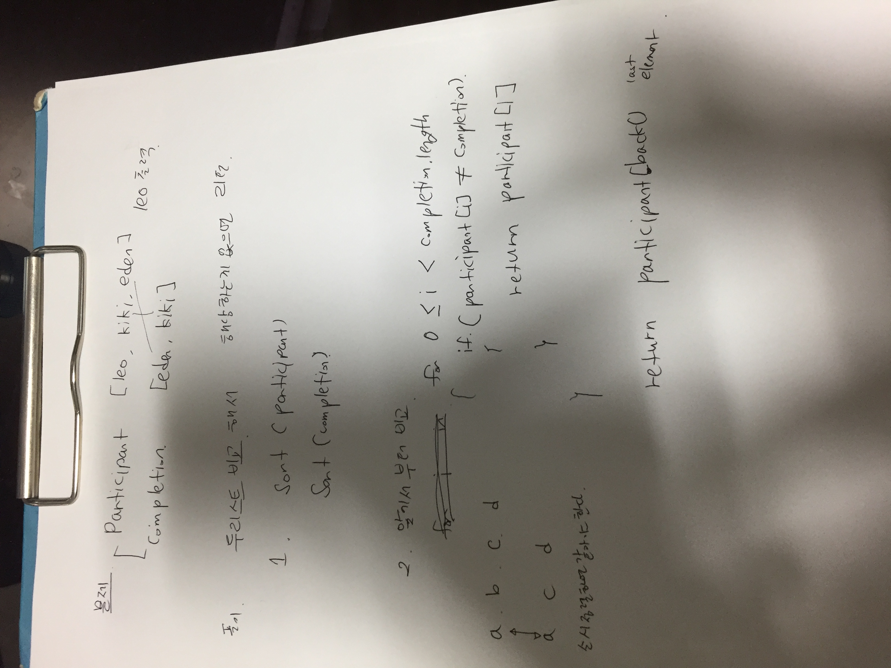


2. [문제](https://programmers.co.kr/learn/courses/30/lessons/42577) 
- 풀이: 
```
#include <string>
#include <vector>
#include <algorithm>
#include <iostream>

using namespace std;

bool solution(vector<string> phone_book) {
    bool answer = true;
    sort(phone_book.begin(), phone_book.end());
    
    for(int i = 0; i < phone_book.size() - 1; i++){
        // cout << phone_book[i] << " ";
        if(phone_book[i].size() <= phone_book[i+1].size()){
            if(phone_book[i] == phone_book[i+1].substr(0, phone_book[i].size())){
                return false;
            }  
        }
    }
    return answer;
}
```

- 손코딩:
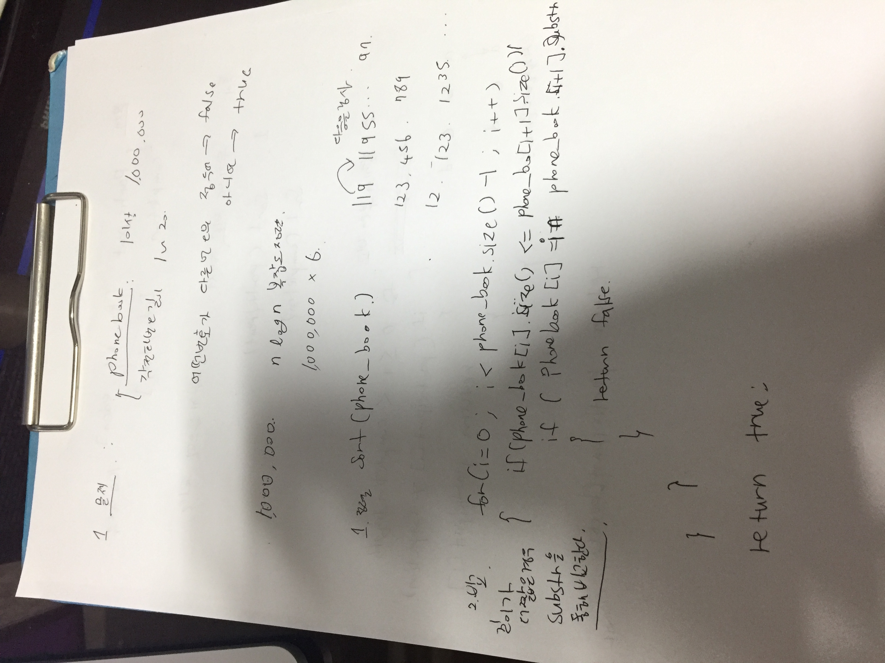


3. [문제](https://programmers.co.kr/learn/courses/30/lessons/42578) 
- 풀이: 
```
#include <string>
#include <vector>
#include <map>

using namespace std;

int solution(vector<vector<string>> clothes) {
    int answer = 1;
    vector<string> v;
    map<string, int> m;
    
    for(int i = 0; i < clothes.size(); i++){
        if(m.count(clothes[i][1]) == 0){
            v.push_back(clothes[i][1]);
            m[clothes[i][1]] = 1;
        } else {
            m[clothes[i][1]]++;
        }
    }
    
    for(int i = 0; i < v.size(); i++){
        answer *= (m[v[i]] + 1);
    }
    answer -= 1;
    
    return answer;
}
```

- 손코딩:
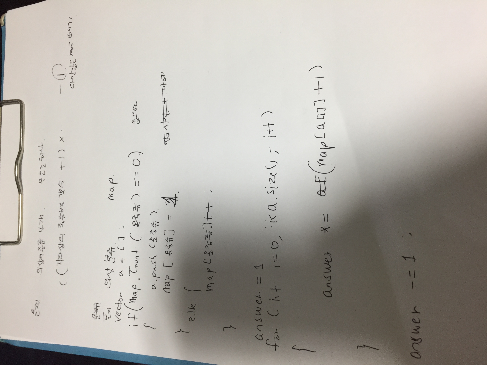


4. [문제](https://programmers.co.kr/learn/courses/30/lessons/42584) 
- 풀이: 
```
#include <string>
#include <vector>
#include <stack>
#include <iostream>

using namespace std;

vector<int> solution(vector<int> prices) {
    vector<int> answer(prices.size(), 0);
    stack<pair<int, int>> s;
    
    for(int i = 0; i < prices.size(); i++){
        if(s.empty() || s.top().first <= prices[i]){
            s.push({prices[i], i});
        }else{
            while(!s.empty() && s.top().first > prices[i]){
                pair<int, int> p = s.top();
                s.pop();
                answer[p.second] = i - p.second;  
            }   
            s.push({prices[i], i});
        }
    }
    
    while(!s.empty()){
        pair<int, int> p = s.top();
        s.pop();
        answer[p.second] = prices.size() - 1 - p.second;
    }
    
    
    return answer;
}
```
- 손코딩:
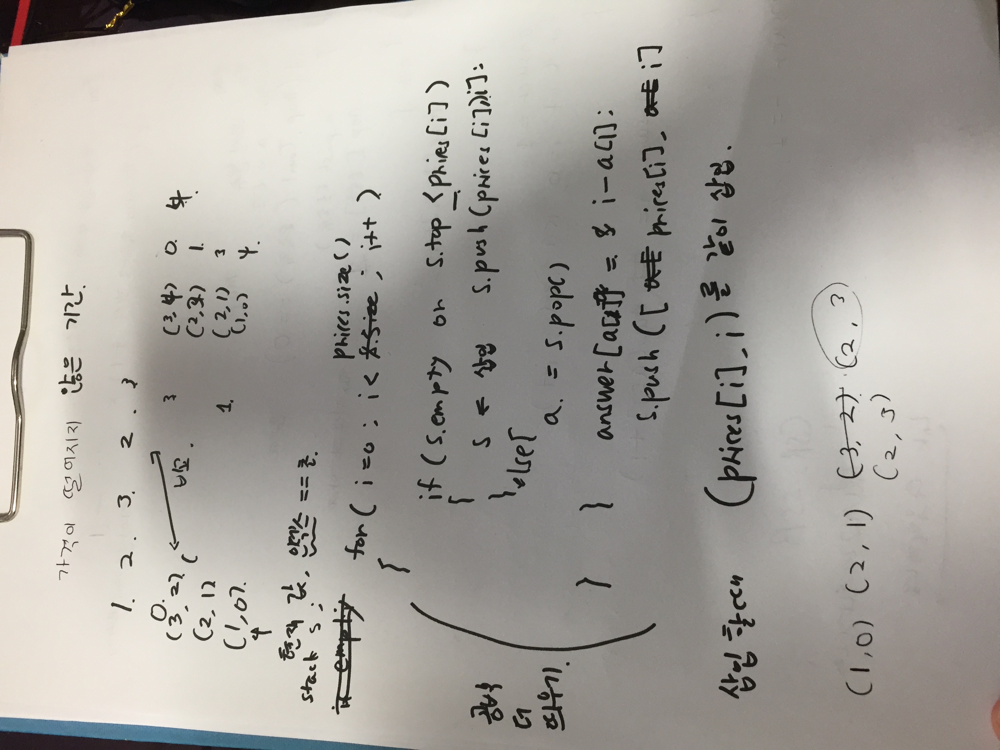


5. [문제]() 
- 풀이:
```
#include <string>
#include <vector>
#include <iostream>
using namespace std;

vector<int> solution(vector<int> progresses, vector<int> speeds) {
    vector<int> answer;
    vector<int> check(progresses.size(), 0);
    
    for(int i = 0; i < progresses.size(); i++){
        int left = 100 - progresses[i];
        if(left % speeds[i] == 0){
            check[i] = left / speeds[i];
        }else{
            check[i] = left / speeds[i] + 1;
        }
    }
    
    int i = 1; 
    int c = 1; 
    int index = 0; 
    while(i < progresses.size()){
        if(check[i] > check[index]){
            answer.push_back(c);
            c = 1;
            index = i;
        }else{
            c++;
        }
        i++;
    }
    
    answer.push_back(c);
    
    return answer;
}
```

- 손코딩:
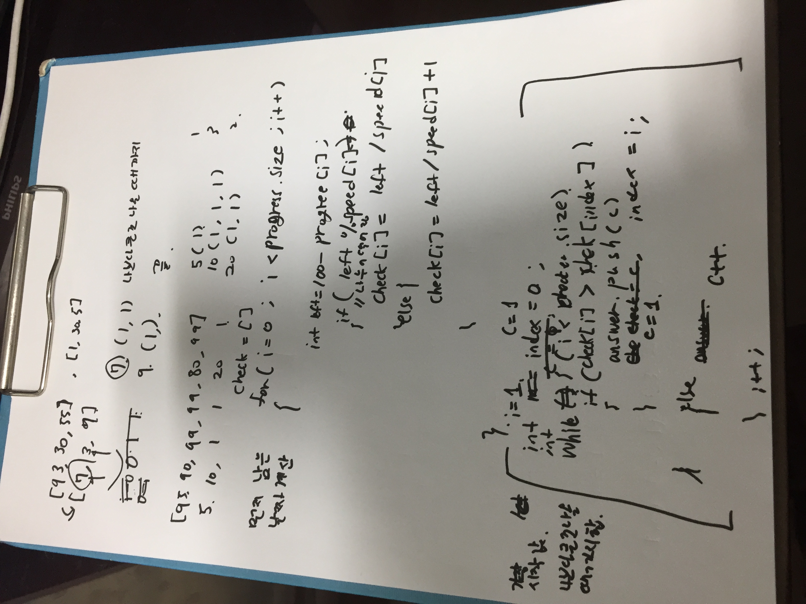

6. [문제](https://programmers.co.kr/learn/courses/30/lessons/42583) 
- 풀이: (https://programmers.co.kr/learn/courses/30/lessons/42583/solution_groups?language=cpp)
  뭔가 암만봐도 안풀렸음. 그리구 손코딩이랑은 다르게, 실제로했을땐 계속 오류가 났음. 예전에 풀었던건데도 이러넴 ㅎ
```
#include <string>
#include <vector>
#include <queue>

using namespace std;

int solution(int bridge_length, int weight, vector<int> truck_weights) {
    int answer = 0;
    int tot_w = 0;
    int t_front = 0;
    int t_cur = 0;
    int sec = 0;
    
    queue<int> q;
    
    while(t_front != truck_weights.size()){
        if(!q.empty() && (sec - q.front() == bridge_length)){
            tot_w -= truck_weights[t_front];
            ++t_front;
            q.pop();
        } 
        
        if(t_cur != truck_weights.size() && tot_w + truck_weights[t_cur] <= weight){
            tot_w += truck_weights[t_cur];
            ++t_cur;
            q.push(sec);
        }
        ++sec;
    }
    
    answer = sec;
    return answer;
}
```

우와 이사람 진짜 똑똑하구만. 

- 손코딩:
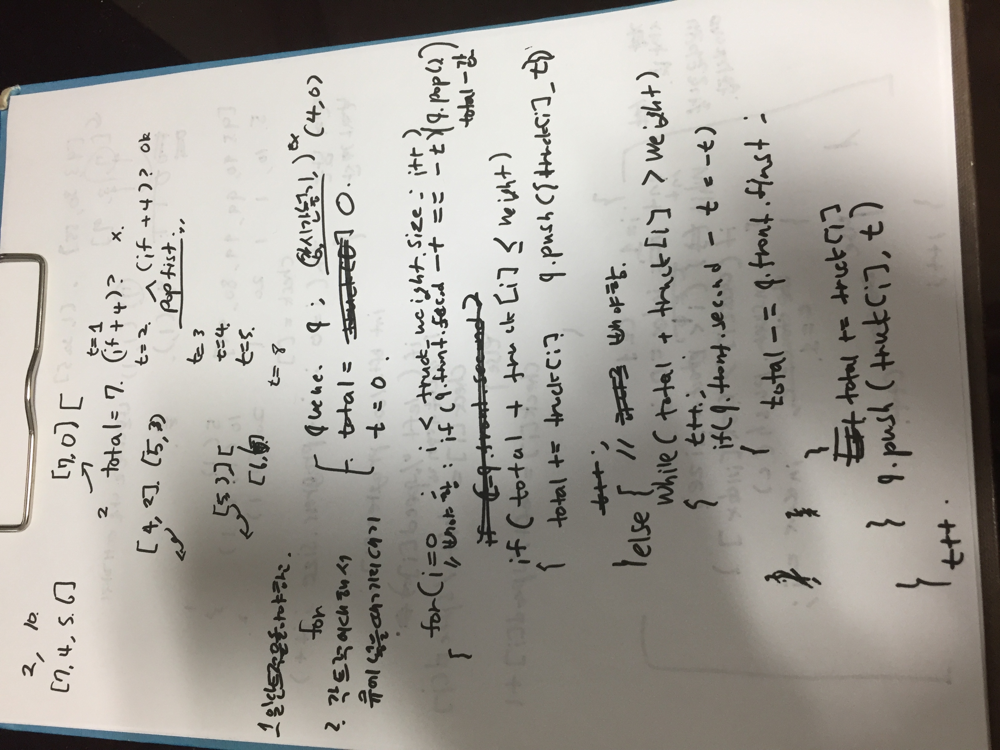

7. [문제](https://programmers.co.kr/learn/courses/30/lessons/43165) 
- 풀이: 
```
#include <string>
#include <vector>

using namespace std;

int answer = 0; 

void recursive(int index, int total, vector<int> numbers, int target){
    if(index >= numbers.size()){
        if(total == target){
            answer++;
        }
        return;
    }
    
    recursive(index+1, total + numbers[index], numbers, target);
    recursive(index+1, total - numbers[index], numbers, target);   
}

int solution(vector<int> numbers, int target) {

    recursive(0, 0, numbers, target);
    
    return answer;
}
```

- 손코딩:
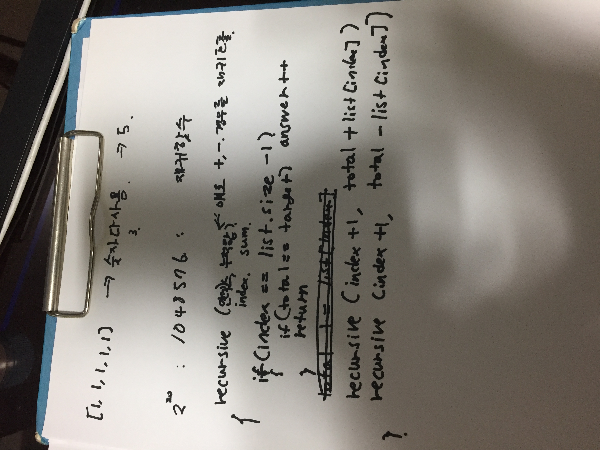

8. [문제](https://programmers.co.kr/learn/courses/30/lessons/43162) 
- 풀이: 
```
#include <string>
#include <vector>
#include <queue>

using namespace std;
vector<int> visited(201, 0);

void bfs(int start, int n, vector<vector<int>> computers){
    queue<int> q;
    q.push(start);
    
    while(!q.empty()){
        int next = q.front();
        q.pop();
        
        for(int i = 1; i <= n; i++){
            if(computers[next-1][i-1] == 1 && visited[i] == 0){
                visited[i] = 1;
                q.push(i);
            }
        }
    }
}

int solution(int n, vector<vector<int>> computers) {
    int answer = 0;
    
    for(int i = 1; i <= n; i++){
        if(visited[i] == 0){
            visited[i] = 1;
            answer++;
            bfs(i, n, computers);
        }
    }

    return answer;
}
```

- 손코딩:
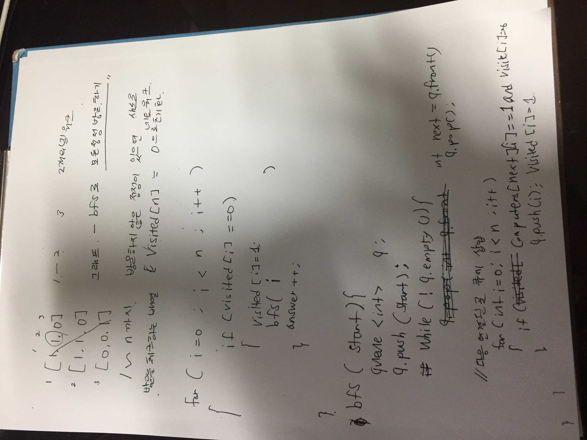


9. [문제](https://programmers.co.kr/learn/courses/30/lessons/43163) 
- 풀이: 
```
#include <string>
#include <vector>
#include <queue>

using namespace std;

bool is_connected(string word1, string word2){
    int count = 0;
    
    for(int i = 0; i < word1.size(); i++){
        if(word1[i] != word2[i]){
            count++;
            if(count > 1){
                return false;
            }
        }
    }
    return true;
}

vector<int> visited(52, -1); // words의 각 인덱스, 마지막에 시작하는 begin 값

int bfs(string begin, string target, vector<string> words){
    queue<int> q;
    q.push(words.size()); //visited의 인덱스를 집어 넣기
    visited[words.size()] = 0; // 거리를 넣을 것, 초기화를 -1로 했음
    words.push_back(begin); // 시작점도 words에 넣음
    
    while(!q.empty()){
        int next = q.front();
        q.pop();
        
        if(words[next] == target){
            return visited[next];    
        }
        
        for(int i = 0; i < words.size() - 1; i++){
            if(visited[i] == -1 && is_connected(words[next], words[i])){
                q.push(i);
                visited[i] = visited[next] + 1;
            }
        }  
    }
    
    return 0; 
}

int solution(string begin, string target, vector<string> words) {
    int answer = 0;
    
    answer = bfs(begin, target, words);
     
    return answer;
}
```

- 손코딩:
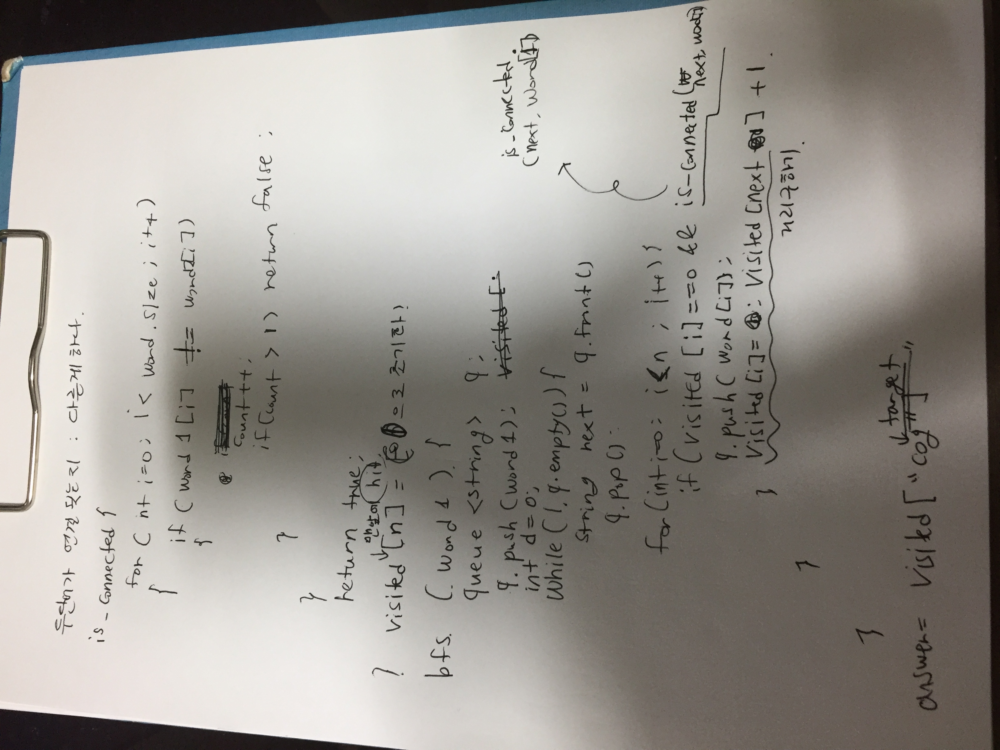


10. [문제](https://programmers.co.kr/learn/courses/30/lessons/42839#) 
- 풀이: 소수 sqrt해서 제곱근까지만 구해라. 복잡도 너무 올라감. 
```
#include <string>
#include <vector>
#include <iostream>
#include <cmath>
using namespace std;

bool can_make(int n, vector<int> arr){
    string s = to_string(n);
        
    for(int i = 0; i < s.size(); i++){
        if(arr[s[i]-'0'] > 0){
            arr[s[i]-'0']--;
        } else {
            return false;
        } 
    }
 
    return true;
}

int solution(string numbers) {
    int answer = 0;
    int range = 0;
    vector<int> arr(10, 0);
    
    for(int i = 0; i < numbers.size(); i++){
        range = range * 10 + 9;
        arr[numbers[i]-'0']++;
    }
    
    vector<bool> prime(range+1, true);
    prime[0] = false; prime[1] = false;
    
    for(int i = 2; i <= sqrt(range); i++){
        if(prime[i] == false){
            continue;
        }
        for(int j = i*i; j <= range; j += i){    
            prime[j] = false;
        }
    }
    
    for(int i = 2; i <= range; i++){
        if(prime[i] && can_make(i, arr)){
            answer++;
        }
    }
    
    return answer;
}
```

- 손코딩:
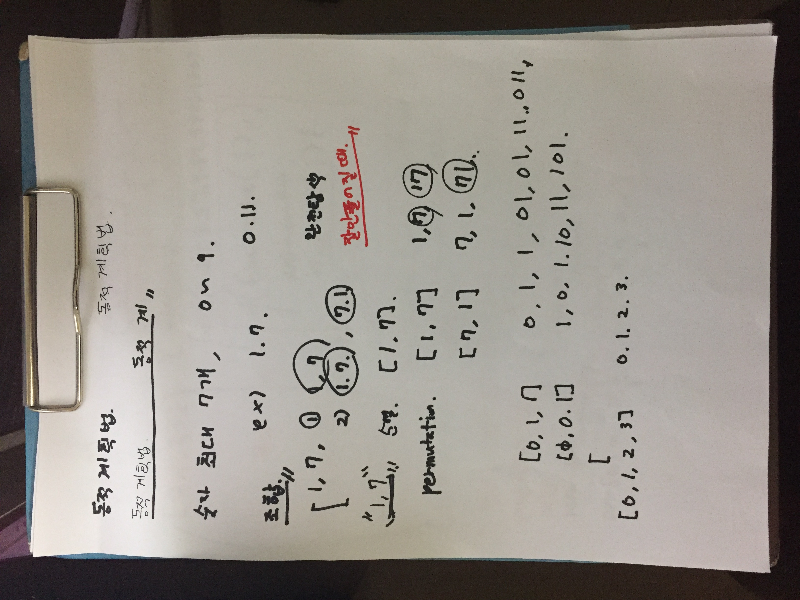
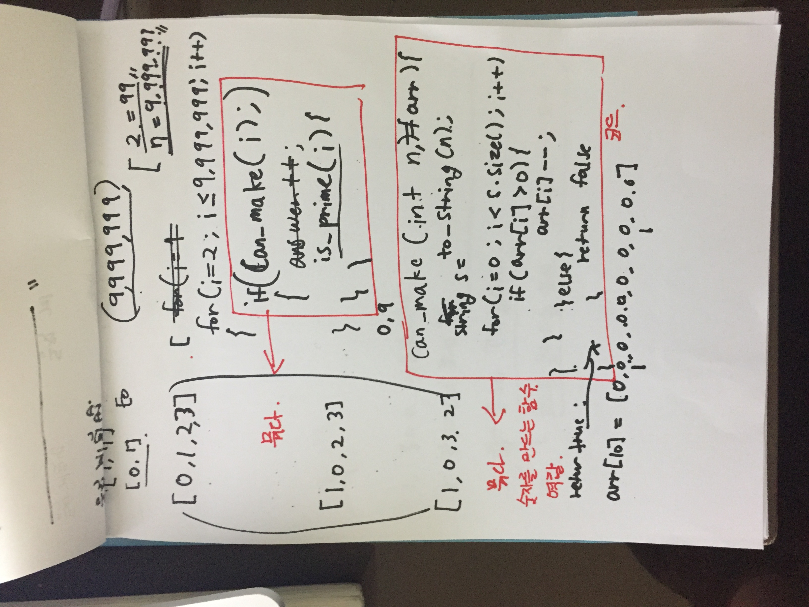
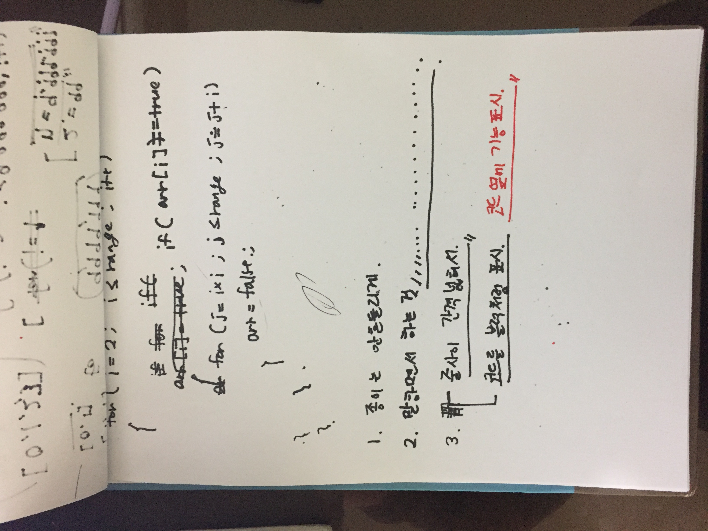

<!-- 
1. [문제]() 
- 풀이: 
- 손코딩:


1. [문제]() 
- 풀이: 
- 손코딩:


1. [문제]() 
- 풀이: 
- 손코딩:
 -->
