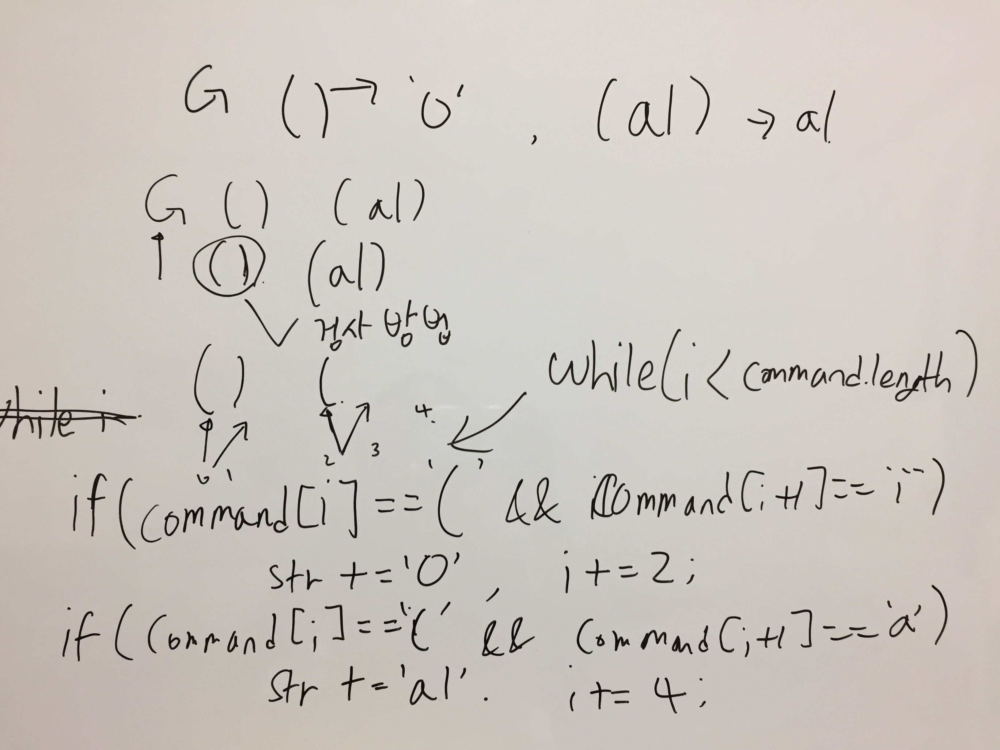

# Link to Question
https://leetcode.com/contest/weekly-contest-218/problems/goal-parser-interpretation/

## Question Summary

## My solution summary
음청 간단한 문제


## My code
```
/**
 * @param {string} command
 * @return {string}
 */
var interpret = function(command) {
    let i = 0;
    let st = '';
    while(i < command.length){
        if(command[i] === '(' && command[i+1] === ')'){
            st += 'o';
            i = i + 2;
        }else if(command[i] === '(' && command[i+1] === 'a'){
            st += 'al';
            i = i + 4;
        }else{
            st += command[i];
            i = i + 1;
        }  
    }
    
    return st;
};
```