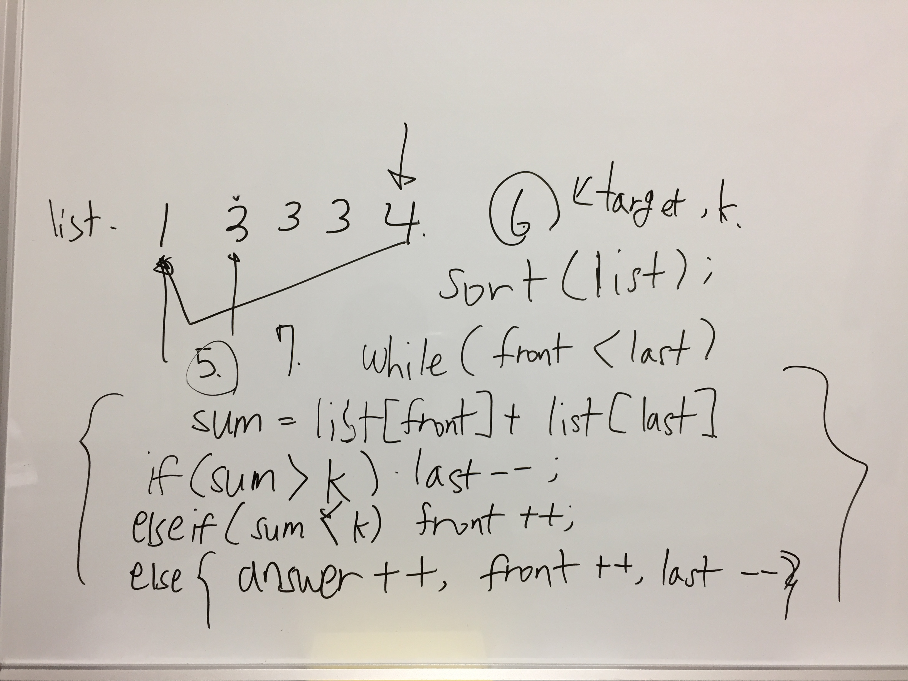

# Link to Question
https://leetcode.com/contest/weekly-contest-218/problems/max-number-of-k-sum-pairs/

## Question Summary

## My solution summary
이것두 쉽다. 


## My code
```/**
 * @param {number[]} nums
 * @param {number} k
 * @return {number}
 */
var maxOperations = function(nums, k) {
    nums.sort((a, b) => a - b);
    let front = 0;
    let last = nums.length - 1;
    let answer = 0;
    while(front < last){
        const s = nums[front] + nums[last];  
        if(s > k) {
            last--;
        }else if(s < k){
            front++;
        }else{
            answer++;
            front++;
            last--;
        }
    }
    
    return answer;
};
```
