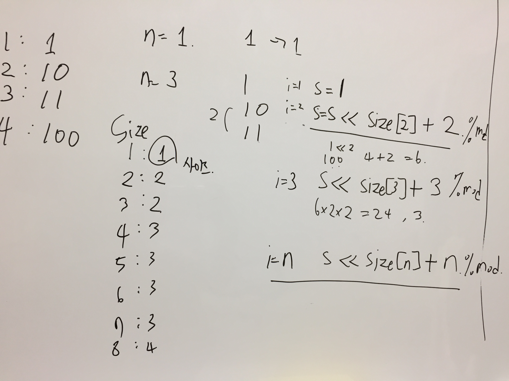

# Link to Question
https://leetcode.com/contest/weekly-contest-218/problems/concatenation-of-consecutive-binary-numbers/

## Question Summary

## My solution summary
조금 삽질을 했다. 
포인트는 바로 숫자로 하면 범위가 넘쳐서 안되고, 
모듈러 연산은 2, 4, 8, 16 ... 할때도 해줘야한다, 아니면 또 넘친다. 

초기의 풀이는 숫자를 바로 하려고 했다. 

근데 저건 n이 커지면 범위가 넘어가서 안된다. 그래서 다시 스트링으로 처리하도록 했다. 

스트링으로 처리한다음엔, 각 숫자를 몇의 자리인지 구해서 더해만 주면 되는데, 이때 미리미리 다 모듈러 연산해준다. 

## My code

```
/**
 * @param {number} n
 * @return {number}
 */
var concatenatedBinary = function(n) {
    const div = 1000000000 + 7;
    
    let s = '';
    for(let i = 1; i <= n; i++){
        s += i.toString(2);
    }
    
    let answer = 0;
    let j = 1;
    for(let i = 0; i < s.length; i++){
        if(s[s.length - 1 - i] === '1'){
            answer = (answer + j) % div;
        }
        j *= 2;
        j %= div;
    }
    
    return answer; 
};
```

```
/**
 * @param {number} n
 * @return {number}
 */
var concatenatedBinary = function(n) {
//     const checkSize = [0];
//     let two = 1;
//     let mul = 2;
//     let i = 1;
//     while(i <= n){
//         if(i < mul){
//             checkSize.push(two);
//         }else{
//             two += 1;
//             mul *= 2;
//             checkSize.push(two);
//         } 
//         i = i + 1;
//     }
    
    const div = 1000000000 + 7;
    
    let s = '';
    for(let i = 1; i <= n; i++){
        s += i.toString(2);
    }
    
    let answer = 0;
    let j = 1;
    for(let i = 0; i < s.length; i++){
        if(s[s.length - 1 - i] === '1'){
            answer = (answer + j) % div;
        }
        j *= 2;
    }
    
    return answer; 
};
```
